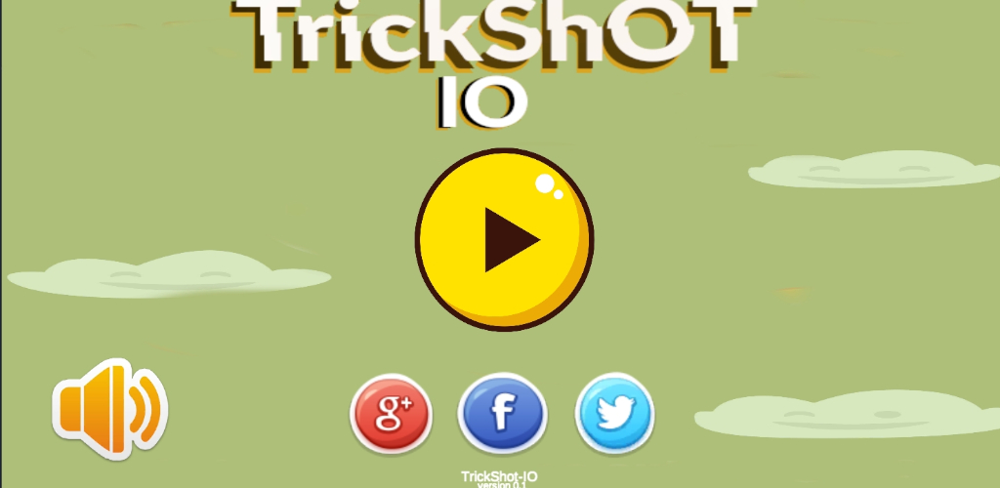
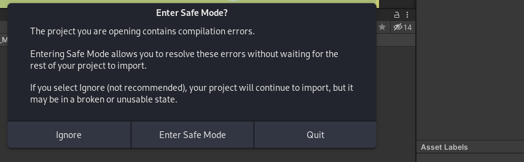

# Trickshot

Is a Touch and Drag game.Direct the ball towards the goal post.Challenge yourself with each progressively more difficult level, win levels with less moves.TrickShot-IO is an addictive and fun-inducing game in which your goal is to reach the goal post before you run out of time or moves. This game is released with over 20 levels which will grant you extreme and long lasting entertainment.Avoid exploding cans and beware of our AI powered SHOOTING CANON.

**Full Project**
- [Download full Project](https://drive.google.com/drive/folders/1J0u6Otan0CzunCMB83V0zWwBATMGF_11?usp=sharing)
=======

# Setup and run
Trickshot IO up until version 0.6 was made using Unity 2020.1.17f1 which is deprecated/not available in Gnome Linux,Because of version differences while trying to work on the game we encountered compilation errors trying to import the game in our new Unity enviroment.

## Fix?
Download the latest version of Unity I'm using(2021.2.2f1).

- Using unityHub open the project you will be presented with splash menu asking if you want to "Enter safe mode" click the ignore button.

- After successfully opening our project go to Our Package manager and re-import all the files that make up our Project that should fix some of our errors.
- I encountered a duplication problem.Most of our  scripts were duplicated which caused compilation errors to fix this just delete the copies, that should remove some of our errors.
- We also discovered that most of our game objects Sprites(images) were automatically removed which forced us to re-apply them one by one just to restore our scenes back to normal its a lot of work but you have to do it if you have the same problem.
- Also our game object scripts were also removed from their game objects,im guessing its because of the Unity version differences.To make it work you are going to have to re- apply them .I think you can figure out which script belongs to which game object just by exploring the files and folders I believe in you you've got this.

- That's all the problems we faced while working on our game update if you are still getting errors you can hit me up I will gladly help.

## Walkaround 

- If you are a Windows/Mac OS user you can find the Unity 2020.1.17f1 Download on their website .You are so lucky wish i could be you.

# Future ADDONS

- Points System
- Power Ups 
- Player Selector
- Add a jumping button 
- Moree animations!!!!!!!!!!!!!!!!!!!!!!!!!!!!!!!!!!!!!!!!!!!!!!!!!!!!!!!!!!!!!!!!!!!!!!!!!!!!!!!!
- Banner ads 
- Revamp our UI

# Notice
 We are not going to be pushing our new update to Github,the provided game via the link should work as a baseline for your own game i think that makes sense. 

## Bye until we release our Update 

To setup the project in Unity just Download the full Game using the provided link and open it in Unity,Dont forget to RE-IMPORT all the necessary packages in unity. using the Package manager
